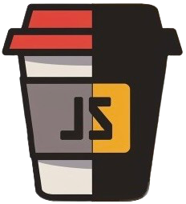

<h1 align="center">
   
  <br>J2JS
</h1>
<p align="center">
  
  
  
</p>
<div align="center">
  <h3>
    <strong>Convert Java code into clean, readable JavaScript in seconds</strong>
  </h3>
  <h4>
    <em>Fast • Experimental • Cross-language</em>
  </h4>
</div>
<p align="center">
  <a href="#-features"><b>✨ Features</b></a> •
  <a href="#-getting-started"><b>🚀 Getting Started</b></a> •
  <a href="#-example"><b>🧪 Examples</b></a> •
  <a href="#-contributing"><b>🙌 Contributing</b></a>
</p>
<hr>


## 💡 About J2JS
J2JS is an experimental code converter that translates Java source code into equivalent JavaScript. It's designed for developers who want to prototype in Java and run in the browser or Node.js environments.

> ⚠️ This project is in beta. Not all Java features are supported yet.

<hr>

## ✨ Features
<table>
  <tr>
    <td width="200"><h3 align="center">🔄</h3><h3 align="center"><b>Java to JavaScript</b></h3></td>
    <td>Convert core Java logic into readable JavaScript</td>
  </tr>
  <tr>
    <td width="200"><h3 align="center">🧠</h3><h3 align="center"><b>Smart Mappings</b></h3></td>
    <td>Translates control structures, variables, and functions</td>
  </tr>
  <tr>
    <td width="200"><h3 align="center">⚡</h3><h3 align="center"><b>Fast Parsing</b></h3></td>
    <td>Optimized for quick single-file conversions</td>
  </tr>
</table>
<hr>

## 🚀 Getting Started
Download
Download the Repo, in the dist folder you will find the .exe
<hr>

## 🧪 Example

```java
javapublic class HelloWorld {
  public static void main(String[] args) {
    System.out.println("Hello from Java!");
  }
}
```
```javascript
javascriptclass HelloWorld {
  static main(args) {
    console.log("Hello from Java!");
  }
}
```
<hr>

### 🙌 Contributing
Contributions are welcome! Help us improve the conversion accuracy, extend feature support, or fix bugs.
<div align="center">
  <p><i>© 2025 nathanschmid08</i></p>
</div>
